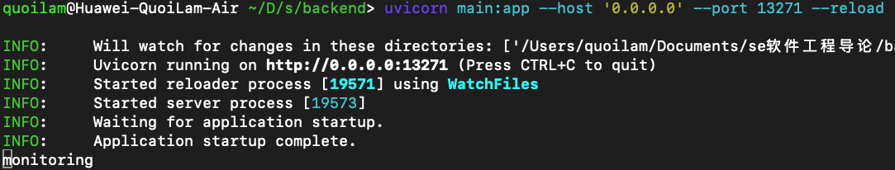

# 一步步跟着做不一定能跑起来,有问题需要小修改 (

# 后端

需要安装有postgresql,并创建用户以及数据库
```
user = 'postgres'
password = '123' 
database = 'contents'
```


```sh
cd backend
pip install -r requirements.txt
uvicorn main:app --host '0.0.0.0' --port 13271 --reload
```
#### 成功运行效果:

并且浏览器访问http://127.0.0.1:13271能看到{"hello":"world"}

# 前端
```sh
cd frontend
# 需要先安装npm
npm install
npm run dev
```

#### 成功运行效果:


此时直接访问http://127.0.0.1:8080即可


# 其他内容
- 后端使用python,接口fastapi,数据库pgsql,大模型api  siliconcloud.com,模型llama3-8b
- 前端使用svelte typescript